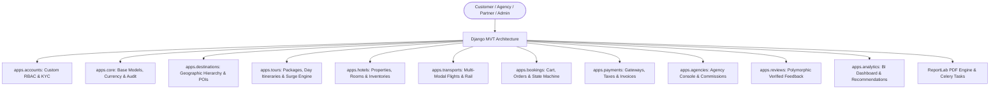

# TravelSphere — Enterprise Travel & Tour Management Platform


**TravelSphere** is an enterprise-grade Travel & Tour Management platform built with **Django MVT** architecture. It provides an end-to-end ecosystem connecting **Travelers (Customers)**, **Travel Agencies**, **Hotel Partners**, **Transport Operators**, and **System Administrators**.

---

## 🏛️ System Architecture



---

## ✨ Key Features & Domain Modules

### 🌍 1. Destinations & POIs (`apps.destinations`)
- Full geographic hierarchy: Continents, Countries, States/Provinces, and Cities.
- Comprehensive Destination guides with best season ratings, weather tags, and Points of Interest (POIs).
- Real-time travel advisories and climate pattern data.

### 🧳 2. Tour Packages & Itineraries (`apps.tours`)
- Curated multi-day & single-day tour packages with code SKU generation.
- Day-by-day itineraries with granular time-slot activities, meal plans, and guide assignments.
- Dynamic pricing engine with group-size discount matrices, seasonal surcharges, and departure slot capacity locking.

### 🏨 3. Hotel Management (`apps.hotels`)
- Property catalog for luxury hotels, beach resorts, villas, and boutique stays.
- Room type classifications with bed configurations, amenities, and meal plan options.
- Date-wise room inventory tracking, weekend surge tariffs, and availability locks.

### 🚆 4. Multi-Modal Transports (`apps.transports`)
- Flights, luxury intercity buses, trains, and private chauffeur transfers.
- Station stops (Airports, Railway stations, Bus terminals) and route networks.
- Tiered seat classes (Economy, Business, First Class) and schedule allocations.

### 💳 5. Bookings & Checkout Engine (`apps.bookings` & `apps.payments`)
- Unified shopping cart supporting multiple tours, hotel stays, and transport tickets.
- Multi-step checkout with passenger passport collection and validation.
- Payment gateway abstraction (Stripe, Razorpay, Net Banking, Cards, Wallet).
- Multi-tier tax engine (GST, VAT, tourism levies) and promotional coupon code validation.
- Automated formal invoice generation with PDF export and printable digital e-tickets.

### 🛡️ 6. Agency & Partner Dashboards (`apps.agencies`)
- Agency onboarding, partner rosters, and verified trade license tracking.
- Automated tiered commission calculation engine and payout request workflows.

### ⭐ 7. Reviews & Ratings (`apps.reviews`)
- Universal multi-entity verified reviews for tours, hotels, and destinations.
- Photo attachments, helpful votes, official owner replies, and automated score updates.

### 📊 8. AI Recommendations & BI Analytics (`apps.analytics`)
- Content-based & collaborative trip recommendation engine.
- Dynamic demand-surge pricing calculations based on booking velocity.
- Executive business intelligence dashboard with gross/net revenue metrics.

---

## 🚀 Getting Started

### Prerequisites
- Python 3.11+
- Pip & Virtualenv
- (Optional) Docker & Redis for asynchronous background workers

### Installation & Setup

1. **Clone the repository**:
   ```bash
   git clone https://github.com/Bhola-11/TravelSphere.git
   cd TravelSphere
   ```

2. **Install dependencies**:
   ```bash
   pip install -r requirements.txt
   ```

3. **Apply Database Migrations**:
   ```bash
   python manage.py makemigrations
   python manage.py migrate
   ```

4. **Seed Sample Enterprise Dataset**:
   ```bash
   python manage.py seed_travelsphere_data
   ```

5. **Run the Test Suite**:
   ```bash
   python manage.py test tests
   ```

6. **Start the Development Server**:
   ```bash
   python manage.py runserver
   ```
   Open your browser at `http://127.0.0.1:8000/`

---

## 🔑 Default Demo Accounts

| Role | Email | Password | Access Area |
| :--- | :--- | :--- | :--- |
| **SuperAdmin** | `admin@travelsphere.com` | `AdminPass123!` | Executive BI Console & Django Admin (`/admin/`) |
| **Traveler (Customer)** | `traveler@example.com` | `TravelerPass123!` | Customer Travel Dashboard (`/accounts/dashboard/`) |
| **Agency Partner** | `agency@apexvoyages.com` | `AgencyPass123!` | Agency Partner Console (`/agencies/dashboard/`) |

---

## 🐳 Running with Docker

```bash
docker-compose up --build
```

---

## 📄 License
This project is licensed under the MIT License.
